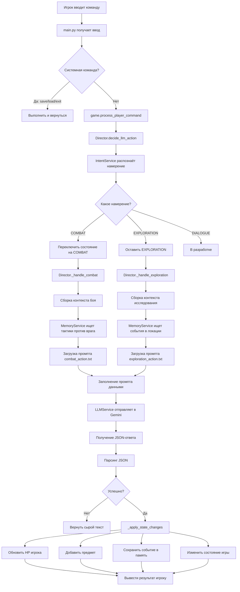

# 📚 Документация проекта "Текстовая RPG с ИИ"

## 🎯 Оглавление

1. [Общая концепция проекта](https://claude.ai/chat/2990fff2-4e80-40ea-97b4-81a2fa276adb#%D0%BE%D0%B1%D1%89%D0%B0%D1%8F-%D0%BA%D0%BE%D0%BD%D1%86%D0%B5%D0%BF%D1%86%D0%B8%D1%8F-%D0%BF%D1%80%D0%BE%D0%B5%D0%BA%D1%82%D0%B0)
2. [Как это работает: Путь команды игрока](https://claude.ai/chat/2990fff2-4e80-40ea-97b4-81a2fa276adb#%D0%BA%D0%B0%D0%BA-%D1%8D%D1%82%D0%BE-%D1%80%D0%B0%D0%B1%D0%BE%D1%82%D0%B0%D0%B5%D1%82-%D0%BF%D1%83%D1%82%D1%8C-%D0%BA%D0%BE%D0%BC%D0%B0%D0%BD%D0%B4%D1%8B-%D0%B8%D0%B3%D1%80%D0%BE%D0%BA%D0%B0)
3. [Архитектура системы](https://claude.ai/chat/2990fff2-4e80-40ea-97b4-81a2fa276adb#%D0%B0%D1%80%D1%85%D0%B8%D1%82%D0%B5%D0%BA%D1%82%D1%83%D1%80%D0%B0-%D1%81%D0%B8%D1%81%D1%82%D0%B5%D0%BC%D1%8B)
4. [Подробное описание модулей](https://claude.ai/chat/2990fff2-4e80-40ea-97b4-81a2fa276adb#%D0%BF%D0%BE%D0%B4%D1%80%D0%BE%D0%B1%D0%BD%D0%BE%D0%B5-%D0%BE%D0%BF%D0%B8%D1%81%D0%B0%D0%BD%D0%B8%D0%B5-%D0%BC%D0%BE%D0%B4%D1%83%D0%BB%D0%B5%D0%B9)
5. [Система данных](https://claude.ai/chat/2990fff2-4e80-40ea-97b4-81a2fa276adb#%D1%81%D0%B8%D1%81%D1%82%D0%B5%D0%BC%D0%B0-%D0%B4%D0%B0%D0%BD%D0%BD%D1%8B%D1%85)
6. [Как запустить проект](https://claude.ai/chat/2990fff2-4e80-40ea-97b4-81a2fa276adb#%D0%BA%D0%B0%D0%BA-%D0%B7%D0%B0%D0%BF%D1%83%D1%81%D1%82%D0%B8%D1%82%D1%8C-%D0%BF%D1%80%D0%BE%D0%B5%D0%BA%D1%82)
7. [Как добавить новый контент](https://claude.ai/chat/2990fff2-4e80-40ea-97b4-81a2fa276adb#%D0%BA%D0%B0%D0%BA-%D0%B4%D0%BE%D0%B1%D0%B0%D0%B2%D0%B8%D1%82%D1%8C-%D0%BD%D0%BE%D0%B2%D1%8B%D0%B9-%D0%BA%D0%BE%D0%BD%D1%82%D0%B5%D0%BD%D1%82)

---

## 🎮 Общая концепция проекта

### Что это?

Это **текстовая ролевая игра** (RPG), где вместо заранее написанного сценария используется **искусственный интеллект** (нейросеть Gemini от Google). Игрок пишет команды обычным языком ("открыть сундук", "атаковать паука"), а ИИ генерирует уникальные ответы, создавая живой, непредсказуемый мир.

### Ключевые особенности

1. **Динамический мир**: Локации, события и описания создаются на лету, а не хранятся заранее
2. **Память мира**: Игра помнит ваши действия и использует их в будущем
3. **Умная система**: ИИ понимает контекст и может вести бой, диалоги, исследование
4. **Процедурная генерация**: Мир строится по иерархии: Континент → Регион → Локация

### Технологии

- **Python 3.10+** — основной язык программирования
- **Google Gemini API** — искусственный интеллект для генерации текста
- **ChromaDB** — векторная база данных для "памяти" игры
- **YAML** — формат файлов с данными о мире

---

## 🔄 Как это работает: Путь команды игрока

### Простыми словами

Представьте, что вы играете в настольную ролевую игру с Мастером Подземелий (ведущим). Вот как это работает в коде:

```
1. ВЫ ПИШЕТЕ: "Атаковать паука мечом"
        ↓
2. РАСПОЗНАВАНИЕ НАМЕРЕНИЯ (IntentService)
   Игра понимает: это АТАКА (не исследование, не диалог)
        ↓
3. РЕЖИССЁР (Director) принимает решение:
   "Это атака → начинаем БОЙ → используем промпт для боя"
        ↓
4. СБОРКА КОНТЕКСТА (Game + MemoryService)
   Собирается досье: что было раньше, где вы сейчас, ваш инвентарь
        ↓
5. СОЗДАНИЕ ПРОМПТА (PromptManager)
   Берётся шаблон промпта и заполняется вашими данными
        ↓
6. ОТПРАВКА В ИИ (LLMService)
   Отправляем огромный текст в Gemini, получаем JSON-ответ
        ↓
7. ПАРСИНГ ОТВЕТА (Game)
   Вытаскиваем из JSON: текст истории + изменения (урон, новые предметы)
        ↓
8. ПРИМЕНЕНИЕ ИЗМЕНЕНИЙ (Game._apply_state_changes)
   Уменьшаем HP, добавляем предметы в инвентарь, сохраняем событие в память
        ↓
9. ВЫ ВИДИТЕ: "Ваш меч рассекает паука! Вы получили 5 урона от его укуса."
```

### Детальная блок-схема



---

## 🏗️ Архитектура системы

### Структура папок проекта

```
rpg_project/
│
├── main.py                    # Точка входа, консольный интерфейс
├── game.py                    # Главный класс игры, управляет всем
├── check_models.py            # Утилита для проверки доступных моделей
├── validate_data.py           # Проверка корректности YAML-файлов
│
├── models/                    # Классы игровых объектов
│   ├── character.py           # Персонаж (HP, статы, инвентарь)
│   ├── inventory.py           # Инвентарь (список предметов)
│   ├── item.py                # Предмет (название, описание)
│   └── location.py            # Локация (название, теги, описание)
│
├── logic/                     # Игровая логика
│   ├── constants.py           # Константы (ключи JSON, типы данных)
│   ├── game_states.py         # Состояния игры (EXPLORATION, COMBAT)
│   └── director.py            # "Режиссёр" - маршрутизатор команд
│
├── services/                  # Сервисы (внешние системы)
│   ├── llm_service.py         # Работа с ИИ (Gemini API)
│   ├── memory_service.py      # Долгосрочная память (ChromaDB)
│   ├── intent_service.py      # Распознавание намерений игрока
│   ├── world_data_service.py  # Загрузка данных о мире
│   └── tag_registry_service.py # Реестр всех тегов
│
├── generators/                # Генераторы мира
│   ├── region_generator.py    # Генерация регионов
│   └── location_generator.py  # Генерация локаций (заглушка)
│
├── utils/                     # Вспомогательные утилиты
│   ├── logger.py              # Логирование событий
│   └── prompt_manager.py      # Загрузка и форматирование промптов
│
├── prompts/                   # Шаблоны промптов для ИИ
│   ├── exploration_action.txt # Промпт для исследования
│   ├── combat_action.txt      # Промпт для боя
│   └── location_description.txt # Промпт для описания локаций
│
├── data/                      # Данные игры (YAML, JSON)
│   ├── world_anatomy.yaml     # Структура мира (континенты, регионы)
│   ├── tags_registry.yaml     # Реестр всех тегов (НЕ ПРИСЛАН)
│   ├── intents.json           # Примеры команд для распознавания
│   └── data_tables/           # Справочники
│       └── anatomy.yaml       # Типы регионов, биомы, ландшафты
│
├── saves/                     # Сохранения игр (JSON)
├── logs/                      # Логи (game_events.log, llm_trace.jsonl)
└── db/                        # База данных ChromaDB
```

### Слои системы

```
┌─────────────────────────────────────────────────────┐
│           СЛОЙ ИНТЕРФЕЙСА                           │
│  main.py - консоль (в будущем: FastAPI, UI)        │
└────────────────────┬────────────────────────────────┘
                     │
┌────────────────────▼────────────────────────────────┐
│         СЛОЙ ИГРОВОЙ ЛОГИКИ                         │
│  game.py - координация всех систем                  │
│  director.py - принятие решений                     │
└────────────────────┬────────────────────────────────┘
                     │
        ┌────────────┼────────────┐
        │            │            │
┌───────▼─────┐ ┌───▼─────┐ ┌───▼──────┐
│  СЕРВИСЫ    │ │ МОДЕЛИ  │ │ ГЕНЕРАТОРЫ│
│             │ │         │ │          │
│ LLM         │ │Character│ │ Region   │
│ Memory      │ │Location │ │ Location │
│ Intent      │ │Item     │ │          │
└─────────────┘ └─────────┘ └──────────┘
        │
┌───────▼─────────────────────────────────────────────┐
│         СЛОЙ ДАННЫХ                                 │
│  YAML файлы, ChromaDB, Saves                        │
└─────────────────────────────────────────────────────┘
```

---

## 📖 Подробное описание модулей

## 1️⃣ `main.py` — Точка входа

### Назначение

Это файл, который вы запускаете. Он создаёт игру, показывает консоль, принимает команды.

### Основная функция

```python
def run_console_version():
```

**Что делает:**

1. Создаёт объект игры: `game = Game()`
2. Инициализирует память примерами лора (факты о мире)
3. Запускает новую игру: `game.start_new_game("Авантюрист")`
4. Входит в бесконечный цикл: получает команды → обрабатывает → выводит результат

**Понимание команд:**

- `выход` / `exit` — закрывает игру
- `save <имя>` — сохраняет игру в файл
- `load <имя>` — загружает игру из файла
- Всё остальное — игровая команда

### Пример работы

```python
# Игрок вводит:
> осмотреться

# Код делает:
result_text = game.process_player_command("осмотреться")
print(result_text)
# Выведет: "Вы стоите в тёмном лесу. Слышен шорох листвы..."
```

---

## 2️⃣ `game.py` — Мозг игры

### Класс `Game`

Это **центральный объект**, который хранит всё состояние игры и координирует работу всех систем.

### Атрибуты (что хранит)

```python
self.player: Character           # Ваш персонаж
self.current_location: Location  # Где вы сейчас
self.state: GameState           # Режим: EXPLORATION или COMBAT
self.short_term_memory: List    # История текущего боя
self.director: Director         # "Режиссёр" - принимает решения
self.memory_service            # Долгосрочная память
self.tag_registry              # Реестр тегов
self.world_data                # Данные о мире
```

### Ключевые методы

#### `start_new_game(player_name: str)`

**Назначение:** Создаёт нового персонажа и генерирует стартовый мир.

**Алгоритм:**

```python
def start_new_game(self, player_name: str):
    # 1. Создаём персонажа
    self.player = Character(name=player_name)
    
    # 2. Даём стартовые предметы
    self.player.inventory.add_item(healing_potion)
    self.player.inventory.add_item(old_sword)
    
    # 3. ИЕРАРХИЧЕСКАЯ ГЕНЕРАЦИЯ МИРА:
    
    # Шаг 1: Выбираем континент (пока захардкожено "torax")
    start_continent_id = "torax"
    
    # Шаг 2: Генерируем РЕГИОН внутри континента
    region_passport = region_gen.generate_region_passport_in_context(
        world_data_service=self.world_data,
        tag_registry=self.tag_registry,
        continent_id=start_continent_id
    )
    
    # Шаг 3: Генерируем ЛОКАЦИЮ внутри региона
    location_passport = loc_gen.generate_location_passport(
        region_passport=region_passport,
        tag_registry=self.tag_registry,
        world_data_service=self.world_data
    )
    
    # Шаг 4: Создаём объект локации
    self.current_location = Location(passport=location_passport)
```

**Что такое "паспорт"?** Паспорт — это словарь (dict) с полным описанием объекта:

```python
region_passport = {
    "id": "region_dark_forest_001",
    "name": "Тёмный Лес Морглота",
    "description": "Древний лес, проклятый некромантом...",
    "tags": ["forest", "dark_magic", "undead"]
}
```

---

#### `process_player_command(command: str) -> str`

**Назначение:** Главный метод обработки команд игрока.

**Алгоритм:**

```python
def process_player_command(self, command: str) -> str:
    # 1. Отправляем команду Режиссёру
    raw_response = self.director.decide_llm_action(self, command)
    
    # 2. Парсим JSON из ответа ИИ
    try:
        # Находим JSON в тексте (между { и })
        json_string = extract_json_from_text(raw_response)
        response_data = json.loads(json_string)
        
        # 3. Извлекаем части ответа
        narrative = response_data["narrative"]  # Текст истории
        changes = response_data["state_changes"]  # Механические изменения
        
        # 4. Применяем изменения
        return self._apply_state_changes(changes, narrative, command)
        
    except json.JSONDecodeError:
        # Если JSON не распарсился, вернём сырой текст
        return raw_response
```

**Пример JSON-ответа от ИИ:**

```json
{
  "narrative": "Ваш меч рассекает паука пополам. Из его тела выпадает ключ.",
  "state_changes": {
    "add_item": "Ржавый ключ",
    "damage_player": 3,
    "new_event": "Игрок убил паука в Тёмном лесу",
    "new_game_state": "EXPLORATION"
  }
}
```

---

#### `_apply_state_changes(changes: dict, narrative: str, command: str) -> str`

**Назначение:** Применяет все механические изменения из ответа ИИ.

**Алгоритм:**

```python
def _apply_state_changes(self, changes, narrative, command):
    feedback_lines = []  # Собираем сообщения для игрока
    
    # 1. Если мы в бою, добавляем в историю боя
    if self.state == GameState.COMBAT:
        self.short_term_memory.append(f"Игрок: '{command}'")
        self.short_term_memory.append(f"Результат: {narrative}")
    
    # 2. Добавление предмета
    if "add_item" in changes:
        item_name = changes["add_item"]
        self.player.inventory.add_item(Item(name=item_name))
        feedback_lines.append(f"(Получен предмет: {item_name})")
    
    # 3. Урон игроку
    if "damage_player" in changes:
        damage = int(changes["damage_player"])
        self.player.take_damage(damage)
        feedback_lines.append(f"(Вы получили {damage} урона!)")
    
    # 4. Сохранение важного события в долгосрочную память
    if "new_event" in changes:
        event_text = changes["new_event"]
        self.memory_service.add_memory(
            text=event_text,
            memory_id=f"event_{random.randint(1000, 9999)}",
            metadata={"type": "event", "location": self.current_location.name}
        )
    
    # 5. Смена состояния игры (например, конец боя)
    if "new_game_state" in changes:
        new_state = changes["new_game_state"]
        if new_state == "EXPLORATION":
            self.change_state(GameState.EXPLORATION)
    
    # Собираем финальный ответ
    return narrative + "\n" + "\n".join(feedback_lines)
```

---

#### `get_context_for_llm() -> dict`

**Назначение:** Собирает текущую ситуацию для передачи в ИИ.

```python
def get_context_for_llm(self) -> dict:
    return {
        "location_tags": ["forest", "dark", "ruins"],
        "location_description": "Вы в тёмном лесу...",
        "player_hp": "15/20",
        "player_stats": {"сила": 10, "ловкость": 12},
        "player_inventory": ["Старый меч", "Зелье лечения"]
    }
```

---

#### `_get_layered_context(search_query: str) -> List[str]`

**Назначение:** Ищет релевантные воспоминания в памяти игры.

**Концепция "слоёв памяти":**

```python
def _get_layered_context(self, search_query: str) -> List[str]:
    all_context = []
    
    # СЛОЙ 1: События в ЭТОЙ локации (важнее всего)
    location_events = self.memory_service.retrieve_relevant_memories(
        query_text=search_query,
        n_results=2,  # Берём 2 последних
        filter_metadata={"type": "event", "location": "Тёмный лес"}
    )
    all_context.extend(location_events)
    
    # СЛОЙ 2: Глобальный лор (общие знания о мире)
    global_lore = self.memory_service.retrieve_relevant_memories(
        query_text=search_query,
        n_results=1,  # Берём 1 самый релевантный
        filter_metadata={"type": "lore"}
    )
    all_context.extend(global_lore)
    
    return all_context
```

**Пример результата:**

```python
[
    "Игрок нашёл ключ от сундука в Тёмном лесу",  # Событие
    "Пауки в этом регионе уязвимы к огню"         # Лор
]
```

---

### Система сохранения/загрузки

#### `save_to_file(filename: str)`

```python
def save_to_file(self, filename: str):
    # Создаём папку saves/, если её нет
    SAVE_DIR.mkdir(exist_ok=True)
    
    # Собираем всё состояние в словарь
    save_data = self.to_dict()
    
    # Записываем в JSON файл
    with open(f"saves/{filename}.json", "w") as f:
        json.dump(save_data, f, indent=4, ensure_ascii=False)
```

#### `to_dict() -> dict`

```python
def to_dict(self) -> dict:
    return {
        "player": self.player.to_dict(),  # Персонаж со всеми данными
        "current_location": self.current_location.to_dict(),
        "game_state": self.state.name,  # "EXPLORATION" или "COMBAT"
        "short_term_memory": self.short_term_memory
        # ChromaDB не сохраняется — она живёт отдельно в папке db/
    }
```

#### `load_from_file(filename: str) -> Game`

```python
@classmethod
def load_from_file(cls, filename: str):
    # Читаем JSON файл
    with open(f"saves/{filename}.json", "r") as f:
        data = json.load(f)
    
    # Создаём НОВЫЙ объект Game
    game = cls()
    
    # Заполняем его данными из файла
    game.load_from_dict(data)
    
    return game
```

---

## 3️⃣ `logic/director.py` — Режиссёр

### Класс `Director`

**Назначение:** Это "мозг", который решает, какой промпт использовать для ИИ в зависимости от команды игрока.

### Инициализация

```python
def __init__(self):
    self.intent_service = IntentService()  # Загружает примеры команд
```

---

### Метод `decide_llm_action(game_instance, player_command) -> str`

**Назначение:** Главный маршрутизатор.

**Алгоритм:**

```python
def decide_llm_action(self, game_instance, player_command) -> str:
    # ШАГ 1: Распознаём намерение
    intent = self.intent_service.recognize_intent(player_command)
    # Результат: "COMBAT", "EXPLORATION", "DIALOGUE" или "UNKNOWN"
    
    # ШАГ 2: Триггер начала боя
    if intent == "COMBAT" and game_instance.state != GameState.COMBAT:
        game_instance.change_state(GameState.COMBAT)
    
    # ШАГ 3: Выбираем обработчик
    if game_instance.state == GameState.COMBAT:
        return self._handle_combat(game_instance, player_command, intent)
    else:
        return self._handle_exploration(game_instance, player_command, intent)
```

---

### Метод `_handle_exploration(game_instance, command, intent) -> str`

**Назначение:** Обрабатывает команды в режиме исследования.

**Алгоритм:**

```python
def _handle_exploration(self, game_instance, command, intent) -> str:
    print("🎬 Режиссёр: Сцена 'Исследование'.")
    
    # 1. Формируем поисковый запрос для памяти
    search_query = f"{' '.join(game_instance.current_location.tags)} {command}"
    # Пример: "forest dark ruins осмотреть алтарь"
    
    # 2. Ищем релевантные воспоминания
    memories_list = game_instance._get_layered_context(search_query)
    memories_str = "\n".join(f"- {item}" for item in memories_list)
    
    # 3. Собираем текущий контекст (HP, инвентарь и т.д.)
    context_dict = game_instance.get_context_for_llm()
    context_json_str = json.dumps(context_dict, ensure_ascii=False, indent=2)
    
    # 4. Загружаем и заполняем шаблон промпта
    prompt = load_and_format_prompt(
        'exploration_action',  # Имя файла: prompts/exploration_action.txt
        memories=memories_str,
        context_json=context_json_str,
        player_action=command
    )
    
    # 5. Отправляем в LLM
    llm_request = {
        "prompt": prompt,
        "prompt_template_name": "exploration_action",
        "game_state": "EXPLORATION"
    }
    return llm._send_prompt_to_gemini(llm_request)
```

**Что попадёт в промпт:**

```
РЕЛЕВАНТНАЯ ПАМЯТЬ ИЗ ИСТОРИИ МИРА:
- Игрок нашёл ключ от сундука в Тёмном лесу
- Пауки уязвимы к огню

ТЕКУЩАЯ СИТУАЦИЯ:
{
  "location_tags": ["forest", "dark", "ruins"],
  "player_hp": "15/20",
  "player_inventory": ["Старый меч", "Зелье лечения"]
}

ДЕЙСТВИЕ ИГРОКА:
> осмотреть алтарь
```

---

### Метод `_handle_combat(game_instance, command, intent) -> str`

**Назначение:** Обрабатывает команды в режиме боя.

**Отличия от исследования:**

```python
def _handle_combat(self, game_instance, command, intent) -> str:
    # 1. Берём ПОЛНУЮ историю текущего боя
    log_str = "\n".join(game_instance.short_term_memory)
    
    # 2. Ищем тактическую информацию о враге
    search_query = f"уязвимости против {' '.join(game_instance.current_location.tags)}"
    lore_list = game_instance.memory_service.retrieve_relevant_memories(
        search_query, 
        n_results=1,
        filter_metadata={"type": "lore"}  # Только лор, не события
    )
    
    # 3. Используем ДРУГОЙ промпт (combat_action.txt)
    prompt = load_and_format_prompt(
        'combat_action',
        lore=lore_str,
        combat_log=log_str,  # Вся история боя!
        player_action=command
    )
    
    # 4. Отправляем
    return llm._send_prompt_to_gemini(llm_request)
```

**Что попадёт в промпт боя:**

```
ПОЛЕЗНАЯ ИНФОРМАЦИЯ:
- Пауки уязвимы к огню

ПОЛНЫЙ ЛОГ БОЯ:
Начало боя в локации: Тёмный Лес.
Игрок: 'атаковать паука мечом'
Результат: Вы наносите 5 урона. Паук кусает вас!
Игрок: 'уклониться и ударить снова'

ДЕЙСТВИЕ ИГРОКА В ЭТОМ ХОДЕ:
> поджечь паука факелом
```

---

## 4️⃣ `services/memory_service.py` — Долгосрочная память

### Класс `MemoryService`

**Назначение:** Управляет векторной базой данных ChromaDB, которая хранит:

- События игры (что сделал игрок)
- Лор мира (факты, правила, тактики)

**Что такое векторная база данных?** Обычная БД ищет по точному совпадению: `WHERE name = 'паук'`. Векторная БД понимает смысл: если вы ищете "тактика против паука", она найдёт "пауки уязвимы к огню", даже если слово "тактика" там не упоминается.

---

### Инициализация

```python
def __init__(self):
    # Создаём клиент, который СОХРАНЯЕТ данные на диск
    client = chromadb.PersistentClient(path="db/")
    
    # Создаём (или подключаемся к) коллекцию
    self.collection = client.get_or_create_collection(
        name="game_world_lore"
    )
```

**ПРОБЛЕМА В КОДЕ:** В файле есть глобальный `client = chromadb.Client()` (НЕ Persistent), который используется вместо того, что создаётся в `__init__`. Данные не сохраняются! Это нужно исправить.

---

### Метод `add_memory(text, memory_id, metadata)`

**Назначение:** Добавляет текст в базу с метаданными.

```python
def add_memory(self, text: str, memory_id: str, metadata: dict):
    collection.add( documents=[text], ids=[memory_id], metadatas=[metadata] ) print(f"✅ Добавлено воспоминание типа '{metadata.get('type')}' с ID: {memory_id}")

````

**Пример использования:**
```python
memory_service.add_memory(
    text="Игрок нашёл ключ от сундука в подземелье",
    memory_id="event_1234",
    metadata={
        "type": "event",           # Тип: событие или лор
        "location": "Тёмный Лес"   # Где произошло
    }
)
````

**Как это хранится внутри ChromaDB:** ChromaDB автоматически превращает текст в "вектор" (массив чисел), который отражает смысл текста. Похожие по смыслу тексты будут иметь похожие векторы.

---

### Метод `retrieve_relevant_memories(query_text, n_results, filter_metadata)`

**Назначение:** Ищет самые релевантные воспоминания.

```python
def retrieve_relevant_memories(
    self, 
    query_text: str,           # Что ищем
    n_results: int = 2,        # Сколько результатов вернуть
    filter_metadata: dict = None  # Фильтр по метаданным
) -> List[str]:
    
    query_options = {
        "query_texts": [query_text],
        "n_results": n_results
    }
    
    # Если нужна фильтрация (например, только события в Тёмном Лесу)
    if filter_metadata:
        # Конвертируем простой словарь в формат ChromaDB
        conditions = []
        for key, value in filter_metadata.items():
            conditions.append({key: {"$eq": value}})
        
        # Если несколько условий, объединяем через AND
        if len(conditions) > 1:
            query_options["where"] = {"$and": conditions}
        else:
            query_options["where"] = conditions[0]
    
    # Выполняем поиск
    results = collection.query(**query_options)
    
    # Возвращаем список текстов
    return results['documents'][0]
```

**Пример использования:**

```python
# Поиск без фильтра
memories = memory_service.retrieve_relevant_memories(
    query_text="как победить паука",
    n_results=3
)
# Вернёт: ["Пауки уязвимы к огню", "Огненные заклинания эффективны против насекомых", ...]

# Поиск с фильтром
memories = memory_service.retrieve_relevant_memories(
    query_text="что произошло у алтаря",
    n_results=2,
    filter_metadata={"type": "event", "location": "Тёмный Лес"}
)
# Вернёт только события из Тёмного Леса
```

---

## 5️⃣ `services/intent_service.py` — Распознавание намерений

### Класс `IntentService`

**Назначение:** Определяет, что хочет сделать игрок: атаковать, исследовать, или разговаривать.

**Принцип работы:**

1. В файле `data/intents.json` есть примеры команд с метками:

```json
[
  {"text": "Атаковать врага мечом", "metadata": {"intent": "COMBAT"}},
  {"text": "Ударить монстра", "metadata": {"intent": "COMBAT"}},
  {"text": "Осмотреться вокруг", "metadata": {"intent": "EXPLORATION"}},
  {"text": "Поговорить с торговцем", "metadata": {"intent": "DIALOGUE"}}
]
```

2. Эти примеры загружаются в ChromaDB
3. Когда игрок пишет команду, ищется самый похожий пример
4. Возвращается его метка (intent)

---

### Инициализация

```python
def __init__(self):
    client = chromadb.Client()
    
    # Удаляем старую коллекцию (если есть)
    existing = [c.name for c in client.list_collections()]
    if "intent_recognition_collection" in existing:
        client.delete_collection(name="intent_recognition_collection")
    
    # Создаём новую
    self.collection = client.get_or_create_collection(
        name="intent_recognition_collection"
    )
    
    # Загружаем примеры из JSON
    self._load_intents_into_chroma()
```

---

### Метод `_load_intents_into_chroma()`

```python
def _load_intents_into_chroma(self):
    # Читаем JSON файл
    with open("data/intents.json", "r") as f:
        intents_data = json.load(f)
    
    # Извлекаем данные
    documents = [item['text'] for item in intents_data]
    metadatas = [item['metadata'] for item in intents_data]
    ids = [f"intent_{i}" for i in range(len(documents))]
    
    # Добавляем в ChromaDB
    self.collection.add(
        documents=documents,
        metadatas=metadatas,
        ids=ids
    )
```

---

### Метод `recognize_intent(player_command) -> str`

**Назначение:** Определяет намерение команды игрока.

```python
def recognize_intent(self, player_command: str) -> str:
    # Ищем 1 самый похожий пример
    results = self.collection.query(
        query_texts=[player_command],
        n_results=1
    )
    
    # Если ничего не найдено
    if not results['metadatas'][0]:
        return "UNKNOWN"
    
    # Извлекаем намерение из метаданных
    intent = results['metadatas'][0][0]['intent']
    print(f"🔍 Распознано: '{player_command}' -> {intent}")
    return intent
```

**Пример работы:**

```python
intent_service.recognize_intent("бить монстра кулаком")
# Найдёт похожий пример: "Ударить монстра" (intent: COMBAT)
# Вернёт: "COMBAT"

intent_service.recognize_intent("что тут есть интересного")
# Найдёт похожий пример: "Осмотреться вокруг" (intent: EXPLORATION)
# Вернёт: "EXPLORATION"
```

---

## 6️⃣ `services/llm_service.py` — Работа с ИИ

### Функция `_send_prompt_to_gemini(request_package) -> str`

**Назначение:** Единственная точка для отправки запросов в Gemini API.

**Что такое request_package?** Это словарь со всей информацией о запросе:

```python
request_package = {
    "prompt": "Огромный текст промпта...",
    "prompt_template_name": "combat_action",
    "game_state": "COMBAT"
}
```

---

**Алгоритм:**

```python
def _send_prompt_to_gemini(request_package: dict) -> str:
    prompt = request_package.get("prompt", "")
    trace = request_package.copy()  # Копируем для лога
    
    try:
        # 1. Создаём модель
        model = genai.GenerativeModel(MODEL_NAME)
        
        # 2. Отправляем запрос
        print("...Отправка запроса в Gemini...")
        response = model.generate_content(prompt)
        
        # 3. Получаем текст ответа
        raw_response = response.text.strip()
        trace["raw_response"] = raw_response
        
        return raw_response
        
    except Exception as e:
        # 4. Если ошибка, возвращаем "аварийный" JSON
        error_message = f"КРИТИЧЕСКАЯ ОШИБКА API: {e}"
        print(f"🔴 {error_message}")
        
        raw_response = """
        {
          "narrative": "В мироздании произошёл сбой. Попробуйте ещё раз.",
          "state_changes": {}
        }
        """
        trace["error"] = error_message
        trace["raw_response"] = raw_response
        return raw_response
        
    finally:
        # 5. Всегда логируем результат (успех или ошибка)
        log_llm_trace(trace)
```

**Что записывается в лог:** Файл `logs/llm_trace.jsonl` содержит полную историю всех запросов к ИИ:

```json
{
  "timestamp": "2025-10-01T14:23:45",
  "prompt": "Ты - Мастер Подземелий...",
  "prompt_template_name": "combat_action",
  "game_state": "COMBAT",
  "raw_response": "{\"narrative\": \"...\", ...}",
  "error": null
}
```

Это позволяет:

- Отладить, почему ИИ дал странный ответ
- Посчитать расход токенов
- Улучшить промпты

---

### Функция `generate_location_description(tags, context) -> str`

**Назначение:** Генерирует художественное описание новой локации.

```python
def generate_location_description(tags: List[str], context: List[str] = None) -> str:
    tags_str = ", ".join(tags)  # "forest, dark, ruins"
    
    # Если есть контекст из памяти, добавляем его
    context_block = ""
    if context:
        context_items_str = "\n".join(f"- {item}" for item in context)
        context_block = f"\nУчти следующую информацию:\n{context_items_str}"
    
    # Загружаем промпт
    prompt = load_and_format_prompt(
        'location_description',
        tags_str=tags_str,
        context_block=context_block
    )
    
    # Отправляем
    llm_request = {
        "prompt": prompt,
        "prompt_template_name": "location_description",
        "game_state": "GENERATION"
    }
    
    return _send_prompt_to_gemini(llm_request)
```

**Пример:**

```python
description = generate_location_description(
    tags=["forest", "dark", "ancient"],
    context=["В этом лесу водятся гигантские пауки"]
)
# Вернёт: "Тёмные стволы древних деревьев возвышаются подобно колоннам..."
```

---

## 7️⃣ `models/` — Игровые объекты

### `models/character.py` — Персонаж

```python
class Character:
    def __init__(self, name: str):
        self.name = name
        self.max_hp = 20
        self.hp = self.max_hp
        self.stats = {
            "сила": 10,
            "ловкость": 10,
            "интеллект": 10,
        }
        self.inventory = Inventory()
```

#### Метод `take_damage(amount: int)`

```python
def take_damage(self, amount: int):
    self.hp -= amount
    if self.hp < 0:
        self.hp = 0  # Здоровье не может быть отрицательным
    print(f"DEBUG: {self.name} получил {amount} урона. Осталось HP: {self.hp}")
```

#### Метод `is_dead() -> bool`

```python
def is_dead(self) -> bool:
    return self.hp <= 0
```

#### Сохранение и загрузка

```python
def to_dict(self) -> dict:
    state = self.__dict__.copy()  # Копируем все атрибуты
    state['inventory'] = self.inventory.to_dict()  # Инвентарь тоже в словарь
    return state

@classmethod
def from_dict(cls, data: dict):
    # Создаём объект БЕЗ вызова __init__
    obj = cls.__new__(cls)
    
    # Загружаем атрибуты
    obj.__dict__.update(data)
    
    # Воссоздаём инвентарь
    obj.inventory = Inventory.from_dict(data['inventory'])
    
    return obj
```

**Зачем `cls.__new__(cls)`?** Обычно объект создаётся так: `Character(name="Герой")`, что вызывает `__init__`. Но при загрузке у нас УЖЕ есть все данные в словаре. `__new__` создаёт "пустой" объект, который мы сразу заполняем.

---

### `models/inventory.py` — Инвентарь

```python
class Inventory:
    def __init__(self):
        self._items: List[Item] = []
    
    def add_item(self, item: Item):
        self._items.append(item)
    
    def remove_item(self, item_name: str):
        # Ищем предмет по имени
        item = next((i for i in self._items if i.name == item_name), None)
        if item:
            self._items.remove(item)
```

**Метод `next()` - что это?**

```python
# Обычный способ найти предмет:
for item in self._items:
    if item.name == item_name:
        found_item = item
        break

# С next() - одна строка:
found_item = next((i for i in self._items if i.name == item_name), None)
#                                                                    ^^^^
#                                                            значение по умолчанию
```

---

### `models/item.py` — Предмет

```python
class Item:
    def __init__(self, name: str, description: str):
        self.name = name
        self.description = description
    
    def to_dict(self) -> dict:
        return {
            "name": self.name,
            "description": self.description
        }
    
    @classmethod
    def from_dict(cls, data: dict):
        return cls(
            name=data.get("name", "Неизвестный предмет"),
            description=data.get("description", "")
        )
```

**Простой класс-контейнер данных.**

---

### `models/location.py` — Локация

```python
class Location:
    def __init__(self, passport: dict):
        self.name = passport.get("name", "Неизвестное место")
        self.tags = passport.get("tags", [])
        self.description = passport.get("description", "")
        self.passport = passport  # Сохраняем весь паспорт
```

**Что такое паспорт?** Паспорт — это полное "досье" локации со всеми данными:

```python
passport = {
    "name": "Тёмный Лес",
    "tags": ["forest", "dark", "ancient"],
    "description": "Зловещий лес с древними деревьями...",
    "biome": "temperate_forest",
    "danger_level": 3,
    # ... в будущем тут могут быть NPC, враги, квесты
}
```

Класс Location просто "оборачивает" этот словарь для удобства.

---

## 8️⃣ `generators/` — Генераторы мира

### `generators/region_generator.py`

#### Функция `generate_region_passport_in_context(world_data_service, tag_registry, continent_id)`

**Назначение:** Генерирует регион внутри выбранного континента.

**Алгоритм:**

```python
def generate_region_passport_in_context(world_data_service, tag_registry, continent_id):
    # 1. Получаем данные континента из YAML
    continent_data = world_data_service.get_continent_data(continent_id)
    # Пример: {"name": "Toрекс", "allowed_region_type_ids": ["dark_forest", "swamp", "ruins"]}
    
    # 2. Получаем список разрешённых типов регионов
    allowed_ids = continent_data.get("allowed_region_type_ids", [])
    
    # 3. Загружаем полные данные этих типов
    allowed_regions = [
        world_data_service.get_region_type_by_id(rid) 
        for rid in allowed_ids
    ]
    
    # 4. Выбираем случайный тип с учётом весов
    weights = [data.get("weight", 1) for data in allowed_regions]
    chosen_type = random.choices(allowed_regions, weights=weights, k=1)[0]
    
    # 5. Создаём паспорт региона
    region_passport = {
        "id": chosen_type['id'],
        "name": chosen_type['name'],
        "description": chosen_type.get("description", ""),
        "tags": chosen_type.get("base_tags", [])
    }
    
    # 6. Валидируем теги
    for tag in region_passport["tags"]:
        if not tag_registry.validate_tag(tag):
            print(f"⚠️ Тег '{tag}' не зарегистрирован!")
    
    return region_passport
```

**Пример данных из YAML:**

```yaml
# data/data_tables/anatomy.yaml
REGION_TYPES:
  - id: dark_forest
    name: Тёмный Лес
    description: Древний лес, полный опасностей
    base_tags: [forest, dark, ancient]
    weight: 10  # Чем больше вес, тем чаще появляется
  
  - id: cursed_swamp
    name: Проклятое Болото
    base_tags: [swamp, cursed, poisonous]
    weight: 5
```

---

### `generators/location_generator.py`

**ВНИМАНИЕ: Это заглушка!**

```python
def generate_location_passport(region_passport, tag_registry, world_data_service):
    # Пока просто копируем имя и теги региона
    location_name = f"Неизведанная часть '{region_passport['name']}'"
    
    location_passport = {
        "name": location_name,
        "description": "Это место еще предстоит исследовать...",
        "tags": region_passport.get("tags", []) + ["неизведанное"]
    }
    
    return location_passport
```

**В будущем здесь должна быть:**

- Выборка из заготовленных типов локаций (храм, пещера, деревня...)
- Проверка совместимости с регионом
- Генерация NPC и предметов
- Создание связей с соседними локациями

---

## 9️⃣ `services/world_data_service.py` — Загрузка данных мира

### Класс `WorldDataService`

**Назначение:** Загружает все YAML-файлы с данными о мире и предоставляет удобный доступ.

```python
class WorldDataService:
    def __init__(self):
        # Загружаем мировую структуру
        self._world_continents = self._load_yaml("data/world_anatomy.yaml")
        
        # Загружаем справочники
        anatomy = self._load_yaml("data/data_tables/anatomy.yaml")
        
        # Превращаем списки в словари для быстрого поиска
        self._region_types = {item['id']: item for item in anatomy["REGION_TYPES"]}
        self._biomes = {item['id']: item for item in anatomy["BIOMES"]}
        self._landmarks = {item['id']: item for item in anatomy["LANDMARKS"]}
```

**Зачем превращать в словарь?**

```python
# Медленно (список):
for region in region_types_list:
    if region['id'] == "dark_forest":
        return region

# Быстро (словарь):
return region_types_dict["dark_forest"]
```

---

#### Метод `_load_yaml(filepath) -> dict`

```python
def _load_yaml(self, filepath: Path) -> dict:
    try:
        with open(filepath, 'r', encoding='utf-8') as f:
            return yaml.safe_load(f)
    except Exception as e:
        print(f"🔴 ОШИБКА: Не удалось загрузить {filepath}: {e}")
        return {}
```

---

#### Геттеры

```python
def get_continent_data(self, continent_id: str) -> dict:
    return self._world_continents.get(continent_id)

def get_region_type_by_id(self, region_type_id: str) -> dict:
    return self._region_types.get(region_type_id)
```

---

## 🔟 `services/tag_registry_service.py` — Реестр тегов

### Класс `TagRegistry`

**Назначение:** Управляет всеми легальными тегами игры. Это "источник правды" — что можно использовать, а что нет.

```python
class TagRegistry:
    def __init__(self, filepath="data/tags_registry.yaml"):
        with open(filepath, 'r') as file:
            self._data = yaml.safe_load(file)
        
        # Собираем все теги в одно множество
        self._all_tags = self._flatten_tags()
```

---

#### Метод `_flatten_tags() -> set`

**Назначение:** Собирает все ID тегов из всех категорий.

```python
def _flatten_tags(self) -> set:
    flat_set = set()
    for category_data in self._data.values():
        if 'tags' in category_data:
            flat_set.update(category_data['tags'].keys())
    return flat_set
```

**Пример структуры YAML:**

```yaml
# data/tags_registry.yaml
biomes:
  tags:
    forest:
      name: Лес
      description: Густой лесной массив
    desert:
      name: Пустыня
      description: Засушливая местность

dangers:
  tags:
    undead:
      name: Нежить
      description: Враги-зомби, скелеты
    dark_magic:
      name: Тёмная магия
      description: Некромантия и проклятия
```

После `_flatten_tags()`: `{"forest", "desert", "undead", "dark_magic"}`

---

#### Метод `validate_tag(tag_id) -> bool`

```python
def validate_tag(self, tag_id: str) -> bool:
    return tag_id in self._all_tags
```

**Использование:**

```python
if not tag_registry.validate_tag("unknown_tag"):
    print("⚠️ Этот тег не зарегистрирован!")
```

---

#### Метод `get_tag_info(tag_id) -> dict`

```python
def get_tag_info(self, tag_id: str) -> dict | None:
    for category_data in self._data.values():
        if 'tags' in category_data and tag_id in category_data['tags']:
            return category_data['tags'][tag_id]
    return None
```

**Использование:**

```python
info = tag_registry.get_tag_info("undead")
# Вернёт: {"name": "Нежить", "description": "Враги-зомби, скелеты"}
```

---

## 1️⃣1️⃣ `utils/` — Утилиты

### `utils/logger.py` — Логирование

#### Функция `setup_logging()`

```python
def setup_logging():
    LOG_DIR.mkdir(exist_ok=True)  # Создаёт папку logs/
```

**Вызывается автоматически** при импорте модуля (в конце файла).

---

#### Функция `log_game_event(tag, message)`

**Назначение:** Записывает человекочитаемое событие.

```python
def log_game_event(tag: str, message: str):
    timestamp = datetime.datetime.now().strftime("%Y-%m-%d %H:%M:%S")
    log_entry = f"[{timestamp}] [{tag.upper()}] {message}\n"
    
    with open("logs/game_events.log", "a") as f:
        f.write(log_entry)
```

**Пример лога:**

```
[2025-10-01 14:23:45] [STATE_CHANGE] EXPLORATION -> COMBAT
[2025-10-01 14:24:12] [PLAYER_INPUT] атаковать паука мечом
```

---

#### Функция `log_llm_trace(trace_data)`

**Назначение:** Записывает технический след вызова ИИ в формате JSONL (JSON Lines).

```python
def log_llm_trace(trace_data: dict):
    trace_data["timestamp"] = datetime.datetime.now().isoformat()
    log_entry = json.dumps(trace_data, ensure_ascii=False) + "\n"
    
    with open("logs/llm_trace.jsonl", "a") as f:
        f.write(log_entry)
```

**Формат JSONL:** Каждая строка — отдельный JSON-объект:

```json
{"timestamp": "2025-10-01T14:23:45", "prompt": "...", "response": "..."}
{"timestamp": "2025-10-01T14:24:12", "prompt": "...", "response": "..."}
```

Это удобно для анализа: можно читать построчно, не загружая весь файл в память.

---

#### Декоратор `@log_player_input`

**Назначение:** Автоматически логирует команды игрока.

```python
def log_player_input(func):
    @functools.wraps(func)
    def wrapper(game_instance, command: str, *args, **kwargs):
        log_game_event("PLAYER_INPUT", command)  # Логируем
        result = func(game_instance, command, *args, **kwargs)  # Вызываем функцию
        return result
    return wrapper
```

**Использование:**

```python
@log_player_input
def process_player_command(self, command: str) -> str:
    # Эта функция автоматически залогирует команду
    ...
```

**Что такое декоратор?** Это "обёртка" для функции. Вместо:

```python
def process_player_command(command):
    log_game_event("PLAYER_INPUT", command)  # Повторяющийся код
    # ... основная логика
```

Пишем один раз:

```python
@log_player_input
def process_player_command(command):
    # ... основная логика
```

---

### `utils/prompt_manager.py` — Управление промптами

#### Функция `load_and_format_prompt(prompt_name, **kwargs)`

**Назначение:** Загружает шаблон промпта и заполняет переменные.

```python
def load_and_format_prompt(prompt_name: str, **kwargs) -> str:
    # 1. Формируем путь к файлу
    filepath = Path("prompts") / f"{prompt_name}.txt"
    
    # 2. Читаем шаблон
    with open(filepath, "r") as f:
        prompt_template = f.read()
    
    # 3. Заполняем переменные
    return prompt_template.format(**kwargs)
```

**Пример шаблона (`prompts/exploration_action.txt`):**

```
Ты — Мастер Подземелий для текстовой RPG.

{memories}

ТЕКУЩАЯ СИТУАЦИЯ:
{context_json}

ДЕЙСТВИЕ ИГРОКА:
> {player_action}

ТВОЙ JSON ОТВЕТ:
```

**Использование:**

```python
prompt = load_and_format_prompt(
    'exploration_action',
    memories="- Игрок нашёл ключ",
    context_json='{"hp": "15/20"}',
    player_action="открыть сундук ключом"
)
```

**Результат:**

```
Ты — Мастер Подземелий для текстовой RPG.

- Игрок нашёл ключ

ТЕКУЩАЯ СИТУАЦИЯ:
{"hp": "15/20"}

ДЕЙСТВИЕ ИГРОКА:
> открыть сундук ключом

ТВОЙ JSON ОТВЕТ:
```

---

## 📊 Система данных

### Структура YAML-файлов

#### `data/world_anatomy.yaml`

**Назначение:** Определяет структуру мира.

```yaml
world_continents:
  torax:
    name: Торакс
    description: Мрачный континент, охваченный тьмой
    allowed_region_type_ids:
      - dark_forest
      - cursed_swamp
      - ancient_ruins
  
  elysium:
    name: Элизиум
    description: Светлый континент с древними храмами
    allowed_region_type_ids:
      - holy_plains
      - crystal_mountains
```

**Логика:** Континент → определяет, какие типы регионов могут в нём появиться.

---

#### `data/data_tables/anatomy.yaml`

**Назначение:** Справочник всех типов регионов, биомов, ландшафтов.

```yaml
REGION_TYPES:
  - id: dark_forest
    name: Тёмный Лес
    description: Древний лес, населённый нежитью
    base_tags: [forest, dark, ancient, undead]
    weight: 10
  
  - id: cursed_swamp
    name: Проклятое Болото
    description: Болото, полное ядовитых испарений
    base_tags: [swamp, cursed, poisonous]
    weight: 5

BIOMES:

- id: temperate_forest name: Умеренный Лес description: Обычный лиственный лес compatible_with: [forest, plains]
    
- id: volcanic_wasteland name: Вулканические Пустоши description: Земля, покрытая лавой и пеплом compatible_with: [mountains, desert]
    

LANDMARKS:

- id: ancient_temple name: Древний Храм description: Руины забытого храма required_tags: [ancient, ruins] spawns_npcs: [priest_ghost, temple_guardian]

````

**Логика:**
- `weight` — вероятность выбора (больше = чаще)
- `base_tags` — теги, которые автоматически добавляются
- `compatible_with` — с какими регионами сочетается
- `required_tags` — какие теги должны быть у локации

---

#### `data/intents.json`

**Назначение:** Примеры команд для обучения распознавателя намерений.

```json
[
  {
    "text": "Атаковать врага мечом",
    "metadata": {"intent": "COMBAT"}
  },
  {
    "text": "Ударить монстра",
    "metadata": {"intent": "COMBAT"}
  },
  {
    "text": "Бью паука со всей силы",
    "metadata": {"intent": "COMBAT"}
  },
  {
    "text": "Осмотреться вокруг",
    "metadata": {"intent": "EXPLORATION"}
  },
  {
    "text": "Посмотреть что в сундуке",
    "metadata": {"intent": "EXPLORATION"}
  },
  {
    "text": "Поговорить с торговцем",
    "metadata": {"intent": "DIALOGUE"}
  }
]
````

**Как добавлять новые примеры:**

1. Добавьте строку в JSON
2. Перезапустите игру (IntentService перезагрузит базу)

---

#### `data/tags_registry.yaml` (НЕ ПРИСЛАН)

**Предполагаемая структура:**

```yaml
# Категории тегов

biomes:
  description: Типы местности
  tags:
    forest:
      name: Лес
      description: Густой лесной массив
    desert:
      name: Пустыня
      description: Засушливая местность
    swamp:
      name: Болото
      description: Топкая местность
    mountains:
      name: Горы
      description: Горная местность

atmosphere:
  description: Атмосфера локации
  tags:
    dark:
      name: Тёмный
      description: Мрачная, зловещая атмосфера
    holy:
      name: Святой
      description: Освящённое место
    cursed:
      name: Проклятый
      description: Место под проклятием

dangers:
  description: Типы опасностей
  tags:
    undead:
      name: Нежить
      description: Зомби, скелеты, призраки
    dark_magic:
      name: Тёмная магия
      description: Некромантия, проклятия
    poisonous:
      name: Ядовитый
      description: Ядовитые существа или среда

age:
  description: Возраст локации
  tags:
    ancient:
      name: Древний
      description: Очень старое место
    ruins:
      name: Руины
      description: Разрушенное строение
    abandoned:
      name: Заброшенный
      description: Покинутое место

structure:
  description: Типы строений
  tags:
    temple:
      name: Храм
      description: Религиозное строение
    dungeon:
      name: Подземелье
      description: Подземное сооружение
    castle:
      name: Замок
      description: Укреплённое строение
```

**Принцип работы:**

- Каждый тег имеет уникальный ID (например, `forest`)
- Категории нужны только для организации (можно смешивать теги из разных категорий)
- При генерации проверяется: есть ли этот тег в реестре?

---

## 🚀 Как запустить проект

### Шаг 1: Установка зависимостей

```bash
# Создать виртуальное окружение (опционально, но рекомендуется)
python -m venv venv
source venv/bin/activate  # На Windows: venv\Scripts\activate

# Установить библиотеки
pip install google-generativeai chromadb python-dotenv pyyaml
```

**Что установится:**

- `google-generativeai` — для работы с Gemini API
- `chromadb` — векторная база данных
- `python-dotenv` — для загрузки переменных окружения из `.env`
- `pyyaml` — для чтения YAML-файлов

---

### Шаг 2: Настройка API-ключа

1. Получите ключ API от Google AI Studio: https://makersuite.google.com/app/apikey
    
2. Создайте файл `.env` в корне проекта:
    

```
GEMINI_API_KEY=ваш_ключ_здесь
GEMINI_MODEL=gemini-2.0-flash-exp
```

**Доступные модели:**

- `gemini-2.0-flash-exp` — быстрая, дешёвая (рекомендуется для разработки)
- `gemini-1.5-pro` — более умная, но дороже
- `gemini-2.5-pro` — самая продвинутая (если доступна)

---

### Шаг 3: Проверка моделей

```bash
python check_models.py
```

**Что делает:** Выводит список всех доступных моделей Gemini для вашего API-ключа.

---

### Шаг 4: Запуск игры

```bash
python main.py
```

**Что произойдёт:**

1. Загрузятся все сервисы (память, теги, данные мира)
2. Создастся персонаж "Авантюрист"
3. Сгенерируется стартовая локация
4. Появится приглашение: `>`

---

### Шаг 5: Игра!

```
> осмотреться
Вы стоите в Тёмном Лесу Морглота. Древние деревья возвышаются вокруг...

> атаковать паука
Ваш меч рассекает паука! Он кусает вас в ответ.
(Вы получили 3 урона!)

Здоровье: 17/20

> использовать зелье лечения
(В разработке)

> save моя_игра
✅ Игра сохранена в файл: моя_игра.json

> exit
До новых встреч, авантюрист!
```

---

## 🛠️ Как добавить новый контент

### Добавление нового типа региона

1. Откройте `data/data_tables/anatomy.yaml`
    
2. Добавьте в секцию `REGION_TYPES`:
    

```yaml
- id: frost_peaks
  name: Ледяные Пики
  description: Заснеженные горы с ледяными пещерами
  base_tags: [mountains, snow, ice, cold]
  weight: 7
```

3. Добавьте теги в `data/tags_registry.yaml`:

```yaml
climate:
  tags:
    snow:
      name: Снежный
      description: Покрыто снегом
    ice:
      name: Ледяной
      description: Замороженный
    cold:
      name: Холодный
      description: Низкая температура
```

4. Разрешите этот регион на континенте (`data/world_anatomy.yaml`):

```yaml
world_continents:
  frostheim:
    name: Фростхейм
    description: Северный замороженный континент
    allowed_region_type_ids:
      - frost_peaks
      - ice_caverns
```

---

### Добавление новых команд

1. Откройте `data/intents.json`
    
2. Добавьте примеры:
    

```json
{
  "text": "Использовать зелье лечения",
  "metadata": {"intent": "USE_ITEM"}
},
{
  "text": "Выпить лечебное зелье",
  "metadata": {"intent": "USE_ITEM"}
},
{
  "text": "Применить бинты",
  "metadata": {"intent": "USE_ITEM"}
}
```

3. Добавьте обработчик в `logic/director.py`:

```python
def decide_llm_action(self, game_instance, player_command):
    intent = self.intent_service.recognize_intent(player_command)
    
    # Добавляем новый случай
    if intent == "USE_ITEM":
        return self._handle_item_use(game_instance, player_command)
    
    # ... остальная логика

def _handle_item_use(self, game_instance, command):
    # Реализация использования предметов
    pass
```

---

### Создание нового промпта

1. Создайте файл `prompts/новое_действие.txt`:

```
Ты — Мастер Подземелий, описывающий использование предмета.

ПРЕДМЕТ В ИНВЕНТАРЕ:
{item_name}: {item_description}

ТЕКУЩЕЕ СОСТОЯНИЕ ИГРОКА:
HP: {player_hp}

ДЕЙСТВИЕ ИГРОКА:
> {player_action}

Опиши результат использования предмета в 2-3 предложениях.
Верни JSON с ключами:
- "narrative": описание
- "state_changes": {{"heal_amount": число}}
```

2. Используйте в обработчике:

```python
prompt = load_and_format_prompt(
    'новое_действие',
    item_name=item.name,
    item_description=item.description,
    player_hp=f"{player.hp}/{player.max_hp}",
    player_action=command
)
```

---

### Добавление лора в память

```python
# В main.py или отдельном скрипте
memory = MemoryService()

memory.add_memory(
    text="Драконы боятся холодного оружия, выкованного из звёздного металла",
    memory_id="lore_dragons_001",
    metadata={"type": "lore", "subject": "dragons", "topic": "weakness"}
)

memory.add_memory(
    text="В древности здесь правил некромант Моргот, создавший армию скелетов",
    memory_id="lore_history_001",
    metadata={"type": "lore", "region": "dark_forest", "topic": "history"}
)
```

**Совет:** Создайте отдельный скрипт `seed_lore.py` для загрузки всего лора сразу.

---

## 🐛 Известные проблемы и решения

### Проблема 1: Данные памяти не сохраняются

**Симптом:** После перезапуска игры события из прошлых сессий исчезают.

**Причина:** В `memory_service.py` глобальная переменная `client` использует `chromadb.Client()` вместо `PersistentClient()`.

**Решение:**

```python
# БЫЛО (НЕПРАВИЛЬНО):
client = chromadb.Client()
collection = client.get_or_create_collection(name="game_world_lore")

class MemoryService:
    def __init__(self):
        client = chromadb.PersistentClient(path=DB_PATH)  # Создаётся, но не используется!

# ДОЛЖНО БЫТЬ:
class MemoryService:
    def __init__(self):
        self.client = chromadb.PersistentClient(path=DB_PATH)
        self.collection = self.client.get_or_create_collection(name="game_world_lore")
```

---

### Проблема 2: Задержка при переключении из исследования в бой

**Симптом:** Первая команда атаки обрабатывается как исследование, только следующая — как бой.

**Причина:** В `director.py` состояние меняется ДО формирования промпта:

```python
if intent == "COMBAT":
    game_instance.change_state(GameState.COMBAT)  # Меняем состояние

if game_instance.state == GameState.COMBAT:
    return self._handle_combat(...)  # Но LLM ещё не знает о бое!
```

**Решение:** Использовать двухэтапную обработку:

```python
def decide_llm_action(self, game_instance, player_command):
    intent = self.intent_service.recognize_intent(player_command)
    
    # Если атака и мы НЕ в бою, используем "промпт начала боя"
    if intent == "COMBAT" and game_instance.state != GameState.COMBAT:
        game_instance.change_state(GameState.COMBAT)
        return self._handle_combat_start(game_instance, player_command)
    
    # Обычная обработка боя
    if game_instance.state == GameState.COMBAT:
        return self._handle_combat(game_instance, player_command)
```

---

### Проблема 3: JSON не парсится

**Симптом:** Ошибка `json.JSONDecodeError` при обработке ответа LLM.

**Причина:** ИИ иногда добавляет текст до или после JSON:

```
Конечно! Вот результат:
{
  "narrative": "..."
}
Надеюсь, это помогло!
```

**Текущее решение:** В `game.py` используется поиск `{` и `}`, но это может сломаться на вложенных объектах.

**Лучшее решение:**

```python
import re

def extract_json_from_text(text: str) -> str:
    # Ищем JSON с помощью regex (поддерживает вложенность)
    pattern = r'\{(?:[^{}]|\{(?:[^{}]|\{[^{}]*\})*\})*\}'
    matches = re.findall(pattern, text)
    
    if matches:
        return matches[0]  # Берём первый найденный JSON
    
    raise ValueError("JSON не найден в тексте")
```

---

### Проблема 4: Теги не валидируются

**Симптом:** В логах появляются предупреждения о незарегистрированных тегах, но игра продолжает работать.

**Причина:** Валидация есть, но она не блокирует выполнение:

```python
if not tag_registry.validate_tag(tag):
    print(f"⚠️ ВНИМАНИЕ: Тег '{tag}' не зарегистрирован!")
    # Но ничего не делается!
```

**Решение:**

```python
for tag in region_passport["tags"]:
    if not tag_registry.validate_tag(tag):
        raise ValueError(f"Нелегальный тег '{tag}' в регионе '{region_passport['id']}'")
```

---

## 📈 Метрики и отладка (ещё не имплементировано)

### Анализ логов LLM

```python
# Скрипт для анализа logs/llm_trace.jsonl
import json

total_requests = 0
errors = 0
exploration_requests = 0
combat_requests = 0

with open("logs/llm_trace.jsonl", "r") as f:
    for line in f:
        data = json.loads(line)
        total_requests += 1
        
        if data.get("error"):
            errors += 1
        
        if data.get("game_state") == "EXPLORATION":
            exploration_requests += 1
        elif data.get("game_state") == "COMBAT":
            combat_requests += 1

print(f"Всего запросов: {total_requests}")
print(f"Ошибок: {errors}")
print(f"Исследование: {exploration_requests}")
print(f"Бои: {combat_requests}")
```

---

### Проверка работы памяти  (ещё не имплементировано)

```python
# test_memory.py
from services.memory_service import MemoryService

memory = MemoryService()

# Добавляем тестовое событие
memory.add_memory(
    text="Игрок победил дракона в Ледяных Пиках",
    memory_id="test_event_001",
    metadata={"type": "event", "location": "Ледяные Пики"}
)

# Проверяем поиск
results = memory.retrieve_relevant_memories(
    query_text="что произошло с драконом",
    n_results=1
)

print("Найдено:", results)
# Ожидаем: ["Игрок победил дракона в Ледяных Пиках"]
```

---

### Валидация данных

```bash
python validate_data.py
```

**Что проверяет:**

- Все теги в `world_anatomy.yaml` зарегистрированы
- Все теги в `anatomy.yaml` зарегистрированы
- Нет конфликтующих ID
- YAML-файлы корректны

---

## 🎓 Советы для начинающих

### Как понять, что происходит в коде?

1. **Добавляйте print() везде:**

```python
def process_player_command(self, command: str):
    print(f"DEBUG: Получена команда: {command}")
    
    raw_response = self.director.decide_llm_action(self, command)
    print(f"DEBUG: LLM вернул: {raw_response[:100]}...")  # Первые 100 символов
    
    # ... остальной код
```

2. **Используйте интерактивную консоль Python:**

```bash
python
>>> from game import Game
>>> game = Game()
>>> game.start_new_game("Тест")
>>> print(game.current_location.tags)
['forest', 'dark', 'ancient']
```

3. **Читайте логи:**

- `logs/game_events.log` — что делал игрок
- `logs/llm_trace.jsonl` — что отправлялось в ИИ и что вернулось

---

### Частые ошибки

#### Ошибка: `ModuleNotFoundError: No module named 'google.generativeai'`

**Решение:** Установите библиотеку: `pip install google-generativeai`

#### Ошибка: `FileNotFoundError: data/tags_registry.yaml`

**Решение:** Создайте этот файл (см. раздел "Система данных")

#### Ошибка: `KeyError: 'narrative'`

**Решение:** LLM вернул неправильный JSON. Проверьте `logs/llm_trace.jsonl`, найдите этот запрос и посмотрите, что вернулось.

---

### Как экспериментировать?

1. **Создайте тестовую локацию:**

```python
test_passport = {
    "name": "Тестовая Комната",
    "tags": ["test", "safe"],
    "description": "Комната для тестов"
}
test_location = Location(passport=test_passport)
```

2. **Напрямую вызывайте LLM:**

```python
from services.llm_service import _send_prompt_to_gemini

response = _send_prompt_to_gemini({
    "prompt": "Опиши короткую сцену боя с пауком",
    "prompt_template_name": "test",
    "game_state": "TEST"
})
print(response)
```

3. **Тестируйте память:**

```python
memory.add_memory("Тестовое событие", "test_001", {"type": "test"})
results = memory.retrieve_relevant_memories("тест", n_results=1)
print(results)
```

---

## 🔮 Будущие улучшения (из `prompts/ideas.py`)

### Планируемые модули

1. **Генератор NPC** — создание персонажей с инвентарём, характером, историей
2. **Предгенерация локаций** — фиксированный список предметов, чтобы не появлялись новые вещи
3. **Система времени** — движение времени вперёд, смена дня/ночи
4. **ИИ врагов** — противники принимают решения
5. **Судья-валидатор** — проверяет корректность ответов LLM
6. **Мета-режиссёр** — выбирает, какие промпты комбинировать
7. **Дебагер-промпт** — периодически проверяет логику игры
8. **Разные нарраторы** — смена стиля повествования как фича игры

---

## 📚 Глоссарий терминов

**Векторная база данных** — БД, которая ищет по смыслу, а не по точному совпадению

**Промпт** — текст-инструкция для ИИ

**Паспорт** — словарь с полными данными объекта (локации, региона)

**Тег** — короткое слово, описывающее свойство (forest, dark, undead)

**Метаданные** — дополнительная информация об объекте (тип, локация, автор)

**Embedding** — векторное представление текста (массив чисел)

**Intent** — намерение игрока (атака, исследование, диалог)

**Lore** — знания о мире (факты, правила, история)

**Event** — событие, произошедшее в игре

**State** — состояние игры (EXPLORATION, COMBAT)

**Decorator** — функция, которая "оборачивает" другую функцию

**JSONL** — формат файла, где каждая строка — отдельный JSON

---

## 🎯 Заключение

Этот проект — амбициозная попытка создать живой, динамический мир с помощью ИИ. Ключевые идеи:

1. **ИИ как ведущий** — не жёсткий сценарий, а креативный соведущий
2. **Память мира** — игра помнит ваши действия и использует их
3. **Процедурная генерация** — мир создаётся по правилам, а не хранится целиком
4. **Модульность** — каждая система независима и может быть заменена

Код ещё сыроват (есть баги), но архитектура заложена правильная. С доработкой это может стать полноценной RPG, где каждое прохождение уникально.

**Удачи в разработке! 🚀**```
